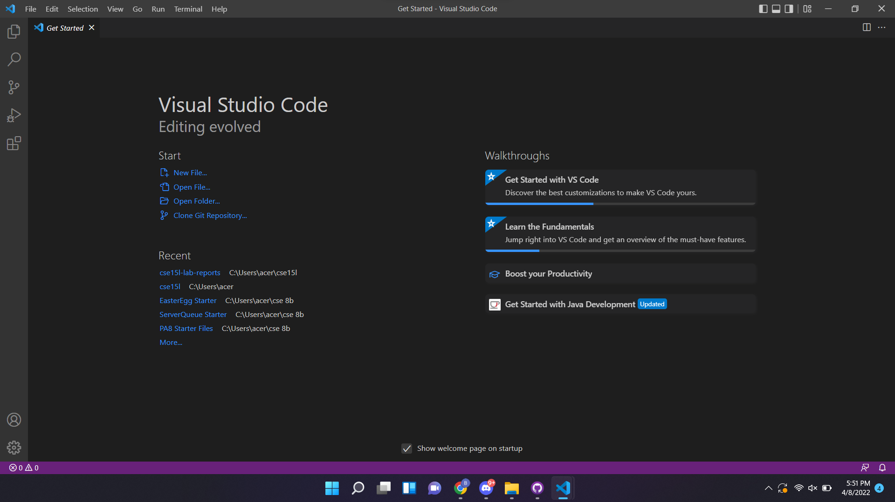
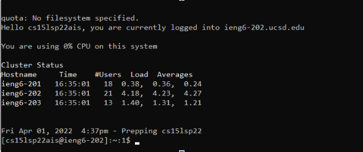
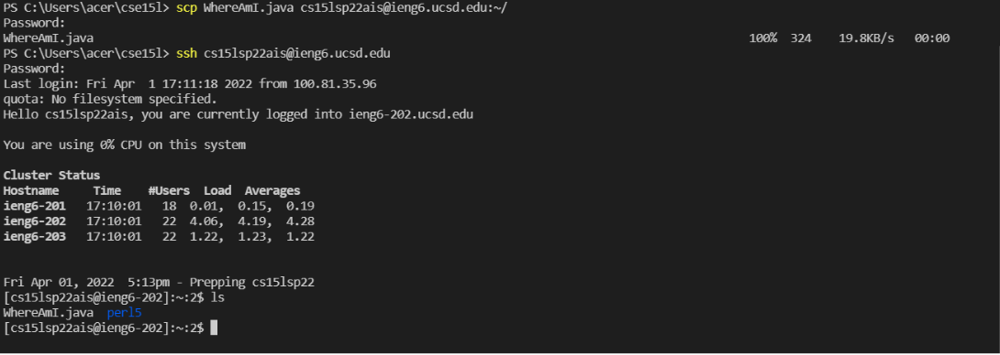
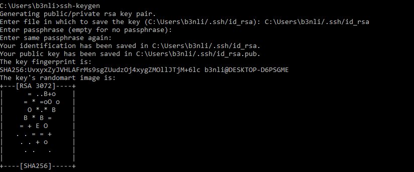
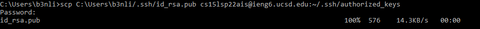
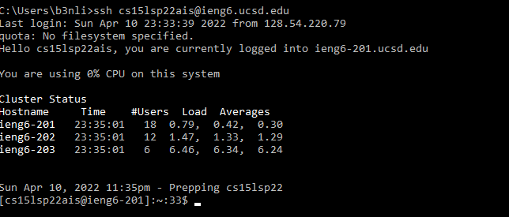
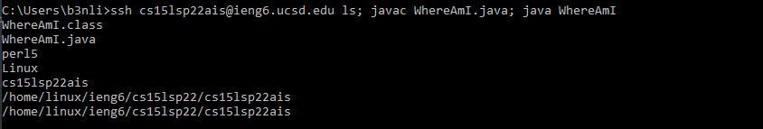

# **CSE 15L Lab Report 1 Week 2**

# Part 1 - Installing VSCode
Head over to [VSCode](https://code.visualstudio.com/) and follow the instructions to download VSCode for your specific operating system.

After successfully installing, launch the VSCode application and you should see a window like this.



# Part 2 - Remotely Connecting
In this part we will connect our machine/ current device to a remote computer on a server to do work there.

First, if not already installed, we need to install the OpenSSH program on the computer which allows your computer to connect to otheres that has the same account.

To install, follow the isntructions for Windows here: [Install OpenSSH](https://docs.microsoft.com/en-us/windows-server/administration/openssh/openssh_install_firstuse)

After installing OpenSSH, we can head over to the terminal in VSCode to start connecting in the remote computer. In the terminal type, replacing *zz* with the letters in your account email:
```
$ssh cs15lsp22zz@ieng6.ucsd.edu
```
Since this is our first time logging in, answer yes to all the questions and input your password when prompted to do so.

You should see a screen like this after logging in:


# Part 3 - Trying Commands
Now try running some commands on your terminal such as:
```
cd

cd~

ls

ls -lat

cp /home/linux/ieng6/cs15lsp22/public/hello.txt ~/

cat /home/linux/ieng6/cs15lsp22/public/hello.txt
```

Here is an exmaple of an ls command run: 


# Part 4 - Moving Files Over SSH with scp
To move files from your machine(the client side), we can use the scp command to move it to the remote server. To move to the remote server, copy this command in the directory where the file was made where *zz* is replaced with the letters in your username: 
```
scp WhereAmI.java cs15lsp22zz@ieng6.ucsd.edu:~/
```
We can check that the file has been copied to the server by running the ```ls``` command on the server side.

An example run shouold look like this:


# Part 5 - SSH Keys
Logging in with your password everytime can be annoying and can be easily fixed with as ssh key. We can make an ssh key by typing this command in our terminal:
```
ssh-keygen
```
Save it in the current file it is listed in and skip the paraphrases. It should look like this after the command:


After, copy the public key file ```C:\Users\<Users>/.ssh/id_rsa.pub``` into the authorized key file in the remote server with the ```scp``` command. It will prompt you to enter your password again and this will be the last time you ever have to do so!!

Here is an example run:


Try logging into your remote account again and it won't prompt you to type in your password now! :D



# Part 6 - Optimizing Remote Running
We can combine our commands into a single line to optimize our runs. For example we can log into the remote server and run the ```ls``` command, complie the ```WhereAmI.java``` file and run the java program with ```java``` with an example run like this where each command is seperated by a semi-colon:
```
ssh cs15lsp22ais@ieng6.ucsd.edu ls; javac WhereAmI.java; java WhereAmI
```

The output would be: 

