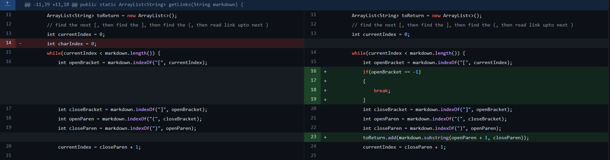
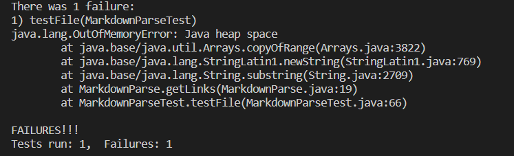
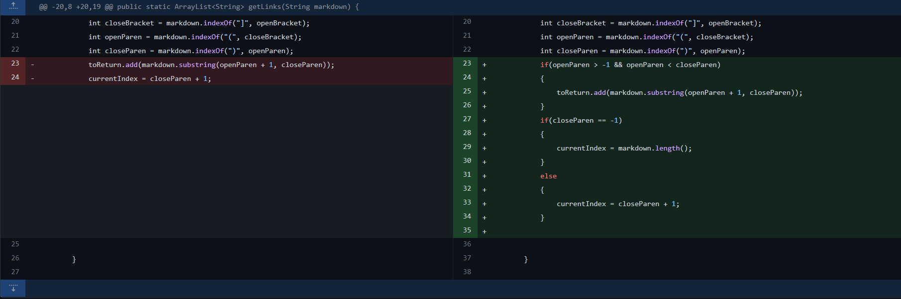
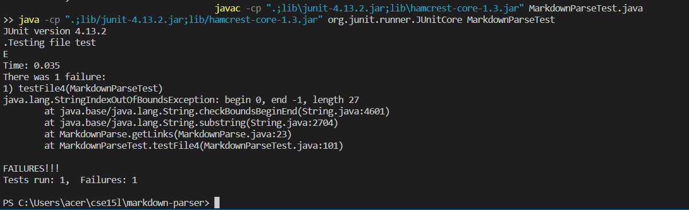
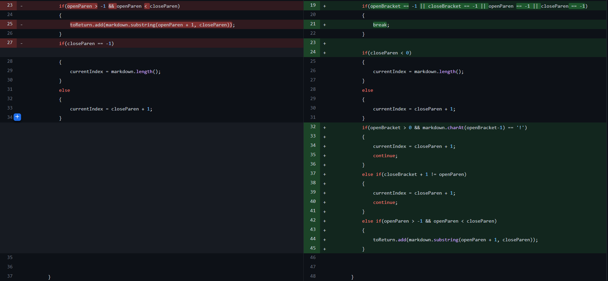
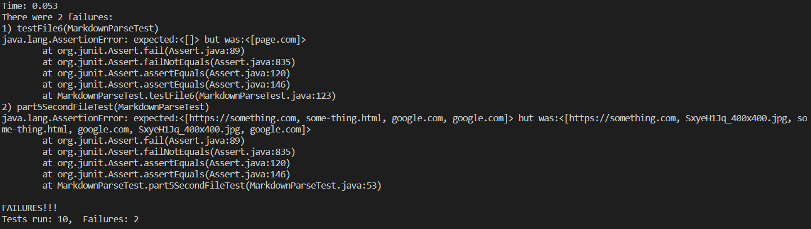

# **CSE 15L Lab Report 2 Week 4**

# Bug 1 Infinite Loop
Our first bug that we noticed was that we were encountering an infinte loop when parsing one of the test files. We concluded that it was due to the extra empty line at the end of the file. Here is what we did to fix the bug: 

Test file that caused the failure-inducing input:
[test-file.md](https://github.com/nidhidhamnani/markdown-parser/blob/main/test-file.md)

Symptom that was cause from this test file:

In the failure inducing input, there was an empty line at the end of the file with no open brackets after it which led to the bug. Since the first line in loop in getLinks gets the index of open bracket starting at the current index and returns -1 if there is no open bracket. Since there was no open bracket it gave an output of -1, but now the close bracket is starting to look for the next close beacket at index -1 which goes back to look in the beginning of the file. This caused the infite loop error and the OutOfMemoryError symptom.

# Bug 2 Out of Bounds Error
Our second bug we noticed is that we encounter an error when trying to add a non existent link. We realized that it was because we were trying to substring negative indicies and this was the commit that allowed us to fix it:

Test file that cause the failure-inducing input:
[test-file4.md](https://github.com/nidhidhamnani/markdown-parser/blob/main/test-file4.md)

Symptom that was caused:

We noticed an index out of bounds error when we parsed test-file4 and quickly realized it was cause we were trying to take a substring give negative indicies and also the first parameter in substring is greater than the second which would throw an exception thus causing the bug. Since openParen and closeParen both don't exist after the closed bracket, both their index are -1 and we are trying to take a substring from 0 (openParen + 1) to -1 (closeParen) which is not possible. This caused the out of bounds symptom that we saw in the terminal.

# Bug 3 Adding Images To List
After testing with some other test files, we noticed that our program also added links to the list as well which we did not want. This is due to the fact that images and links have similar commands with the only difference being in Image having an exclamation mark in the front. This is how we differentiated images from links:

Test file that caused the failure-inducing input:
[test-file6.md](https://github.com/nidhidhamnani/markdown-parser/blob/main/test-file6.md)

Symptom that was caused:

We noticed in some of our test runs that not only are our links getting added, but images as well. The bug was that we didn't check if it was Image notation of a Link notation and the only difference between the two is an exclamation mark in the Image notation which cause the symptom of two arrays not being equal to each other. We expected only links but what we actually got were links and images.