# CSE 15L Lab 3

# Part 1: Streamlining ssh Configuration
* Here is the config file that was edited in VSCode and added to my .ssh folder on my computer
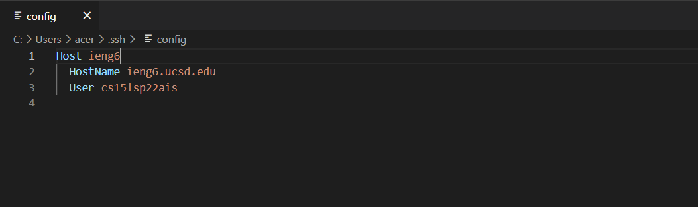

* I am now able to log in to my remote account by just doing ```ssh ieng6```
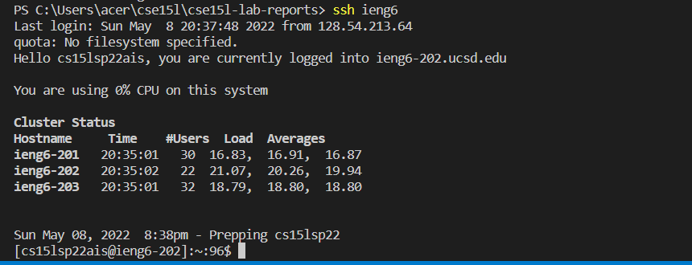

* Also allowed to copy files by typing ```ieng6``` instead of my whole account email
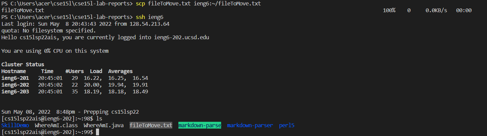

# Part 2: Set Up Github access from ieng6
* Here is the public key that was made on github and its stored in my account settings
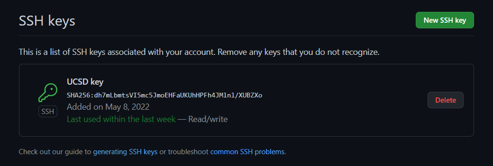

* This key is stored in my user account in the ```know_hosts``` folder of ```.ssh```
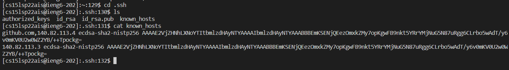

* Able to run git commit and push on the remote server now 
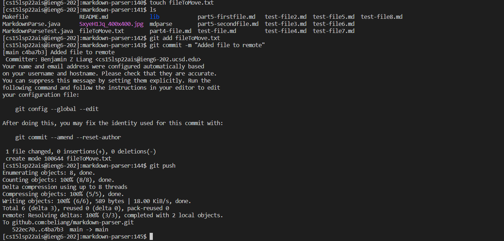

* Here is the link to the [commit history](https://github.com/beliang/markdown-parser/commit/c4ba7b3104a657dd683bc8e29092e756f0f3646e)

# Part 3: Copy Whole Directories with scp

* Copying whole markdown directory with ```scp -r .```
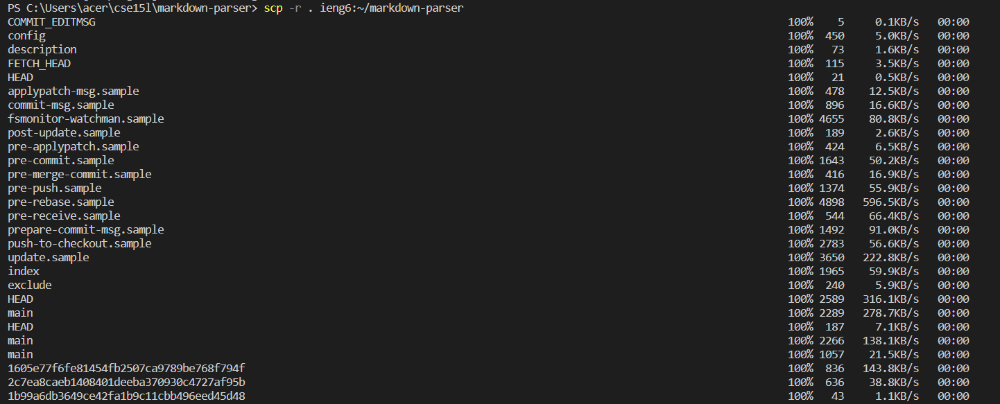

And here are all the files in my remote after copying all 
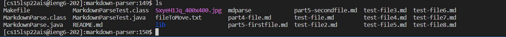

* Compiling and running junit tests on remote
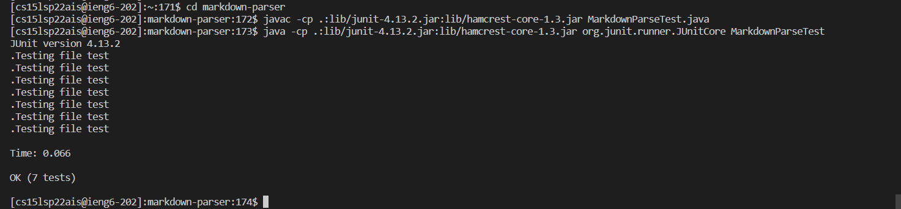

* Copying all, logging in, and running junit tests in one line

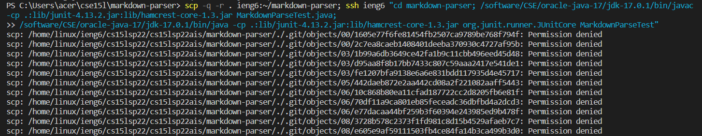
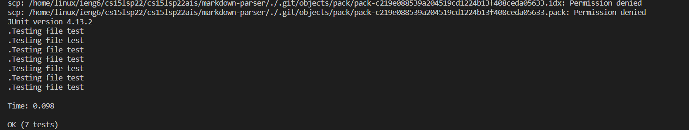
