# CSE 15L Lab Report 4

[My Markdown Parser Repository](https://github.com/beliang/markdown-parser)

[Partner Group Markdown Parser Repository](https://github.com/leahkuruvila/markdown-parser)

## Code Snippet 1

Preview for the snippet 1 md file: 

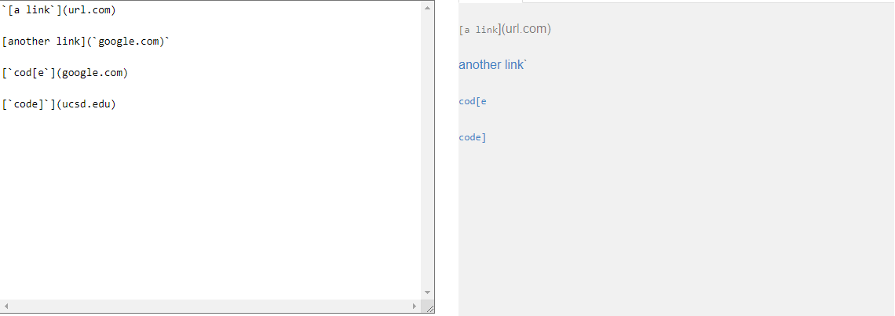

JUnit Test: 
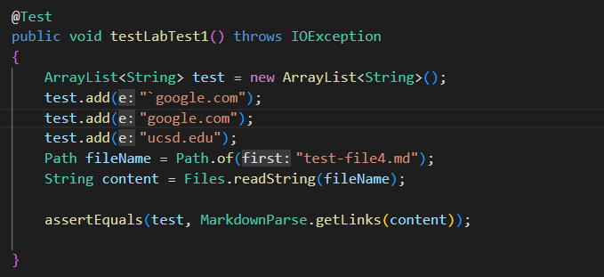

Expected output: [`google.com, google.com, ucsd.edu]

My code failure: 

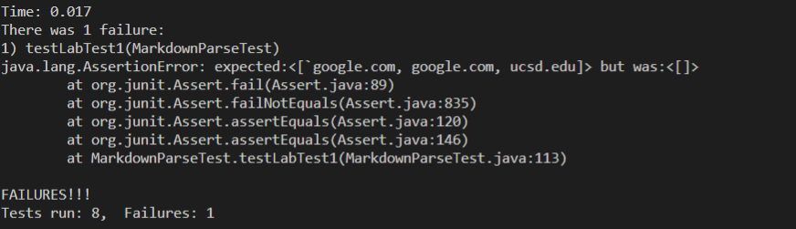

Partner's code failure:

I think there is a code change that can be made to make snippet 1 run properly within 10 lines of code because we can make some checks to see if the backticks are one after the open bracket and one before the closed bracket. If there is a closed bracket that is part of the links, it may be a bit more difficult but we can set the last closed bracket to be index of open parenthesis - 1 because it would be 1 index before the open parenthesis. 

## Code Snippet 2

Preview for the snippet 2 md file: 

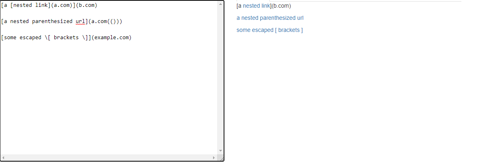

JUnit Test: 
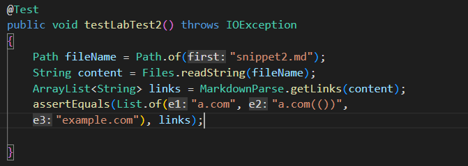

Expected output: [a.com, a.com(()), example.com]

My code failure: 

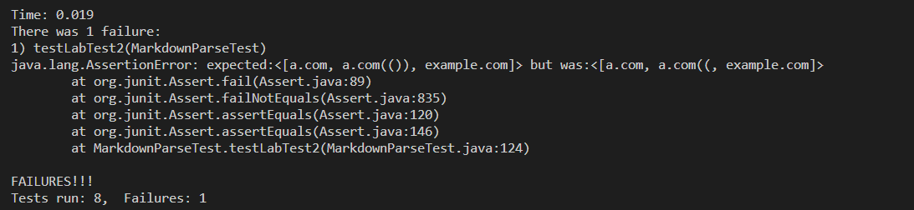

Partner's code failure:

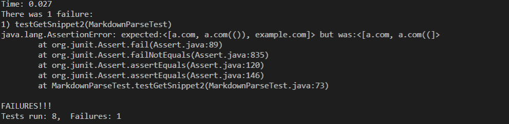

I think there is a code change less than 10 lines that would fix the problem in code snippet 2. It already seems as though our programs are close in getting the links but just missing some parenthesis. A change we could make is going from the open parenthesis to the last close parenthesis to get all the content between them even if there were closed parenthesis in the link format. 

## Code Snippet 3

Preview for the snippet 3 md file: 

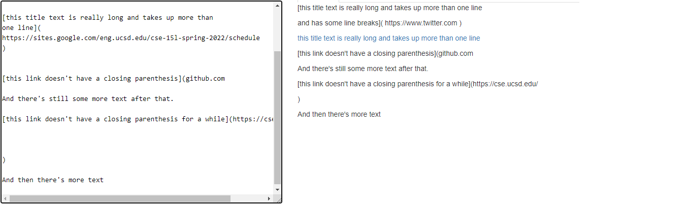

JUnit Test: 
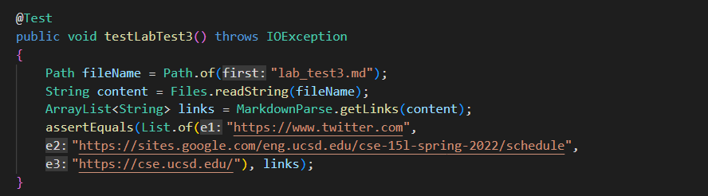

Expected output: [://sites.google.com/eng.ucsd.edu/cse-15l-spring-2022/schedule]

My code failure: 

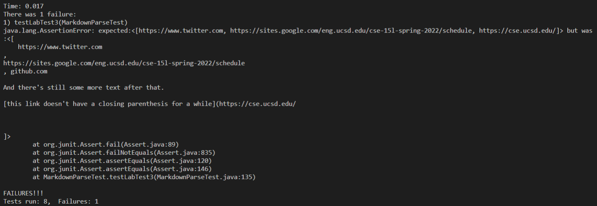

Partner's code failure:

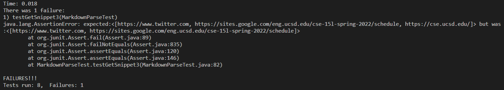

I also think this code snippet could be fixed with a less than 10 line change in our program because first we would need to trim the beginning and ending spaces of our links that we get and then we would get the links starting at the open parenthesis all the way to the closed parenthesis on the same line. In my specific program, I would also need to check if there is another link format after an open parenthesis because that would mean the previous link format was not correct.
